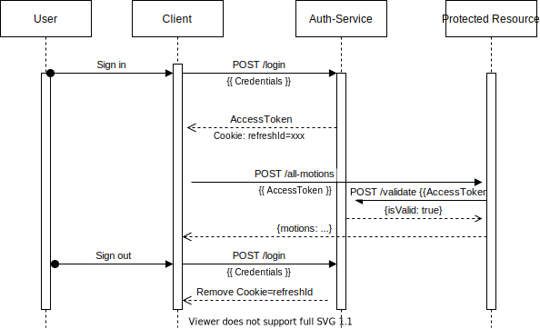
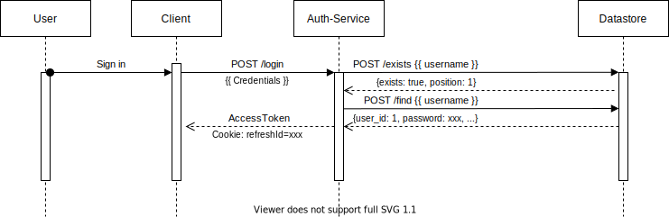
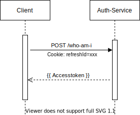
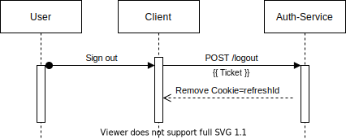
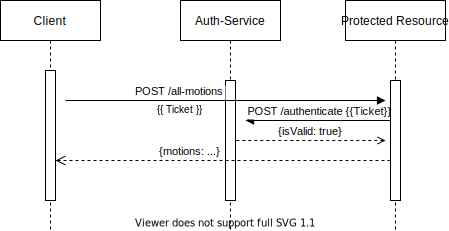
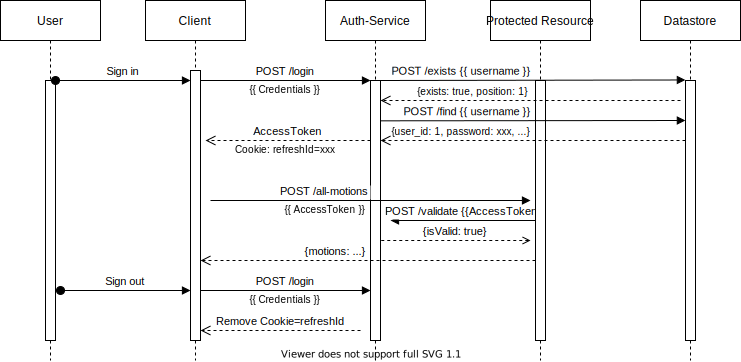

# OpenSlides authentication service

Service for OpenSlides which handles the authentication of users. After a successfully authentication an access_token (passed as header `authentication`) and a cookie (with name `refreshId`) is issued (in the following called `Ticket`).

With this Ticket all routes, that are prefixed with a `secure`, are available.

The combination of cookie and token protects against XSS- and CSRF-attacks. Such cookies are issued with the property `httpOnly`. To understand why and read further things, the document [Implement an auth-service](res/Ausarbeitung_Endfassung.pdf) can be read.

## API

### Interfaces

```ts
// The properties of this interface have to be passed as HTTP-headers in a request.
Interface Ticket {
    authentication: string,
    cookies: {
        refreshId: string,
        [name: string]: string
    }
}


// This describes, which information is received by requesting `authenticate`.
Interface LoginInformation {
    userId: number;
    sessionId: string;
}

// Describes an http-response, which is sent back to any requesting service.
Interface Response <T> {
    set-authentication-header: string // If an old access-token is expired and refreshed, it is set as authentication-header.
    // This determines if a request was successful.
    success: boolean,
    // This sends back a describing message. For example, the reason of a failured request.
    message: string,
    // Optional data, which is appended, if a request was successful.
    data?: T
}


// The credentials for login/authentication are not valid.
Exception InvalidCredentials {
    success: false,
    message: string
}
```

The currently available internal and external routes are listed below:

### external routes

1. `POST login (username: string, password: string): Response<void>`

2. `POST secure/logout (ticket: Ticket): Response<void>`

3. `POST who-am-i (refreshId: string): Response<void>`

4. `GET secure/list-sessions (ticket: Ticket): Response<{sessions: string[]}>`

5. `POST secure/clear-session-by-id (sessionId: string, ticket: Ticket): Response<void>`

6. `POST secure/clear-all-sessions-except-themselves (ticket: Ticket): Response<void>`

A detailed description about these routes are given below:

```ts
/**
* POST to /system/auth/login
*
* A user can login with its credentials for authentication.
* If they are correct, the service answers with a signed Token and sets a cookie,
* containing the sessionId of the client.
*
* If they aren't correct, the service throws an error.
*
* @throws InvalidCredentials
*/
login (username: string, password: string): Response<void>;

/**
* POST to /system/auth/secure/logout
*
* The service deletes the session depending on the given Token.
*
* @throws InvalidCredentials
*/
secure/logout (ticket: Ticket): Response<void> publishes LogoutSessionEvent;

/**
* POST to /system/auth/who-am-i
*
* A request to get knowledge about themselves. This information is contained in the payload of
* a Token. So, this function handles the refreshing of a Token.
* Expects a jwt as string in a cookie (called 'refreshId').
*
* Sends back a new Token (passed as http-header 'authentication').
*
* Throws an exception, if the cookie is empty, the transmitted sessionId
* is wrong or the signature is wrong.
*
* @throws InvalidCredentials
*/
who-am-i (refreshId: string): Response<LoginInformation>;

/**
* POST to /system/auth/secure/clear-session-by-id
*
* Function to sign out one specific client from a user by its corresponding session-id.
*/
secure/clear-session-by-id (sessionId: string, ticket: Ticket): Response<void> publishes LogoutSessionEvent;

/**
* POST to /system/auth/secure/clear-all-session-except-themselves
*
* Function to kill all current opened sessions from one user except the one, which is requesting.
*/
secure/clear-all-sessions-except-themselves (sessionId: string, ticket: Ticket): Response<void> publishes LogoutSessionEvent;

/**
* GET to system/auth/secure/list-sessions
*
* Returns all currently active sessions.
*
* @returns an array containing currently active sessions.
*/
secure/list-sessions (ticket: Ticket): Response<{sessions: string[]}>;
```

### internal routes

1. `authenticate (ticket?: Ticket): Response<LoginInformation>`

2. `hash (toHash: string): Response<{hash: string}>`

3. `is-equals (toHash: string, toCompare: string): Response<{isEquals: boolean}>`

4. `create-authorization-token (userId: Id, email: string): Response<void>`

5. `verify-authorization-token (authorizationToken?: string): Response<{userId: Id, email: string}>`

A detailed description about these routes are given below:

```ts
/**
* POST to /internal/auth/authenticate
*
* This will be a library to act as part of the auth-service. The other services have not to
* request the auth-service for authentication. Instead, they use this library-function in their own
* and receive knowledge about authentication without request.
*
* Throws an exception, if the token is not valid. E.g. if the signature is not valid.
*
* @throws InvalidCredentials
*/
authenticate (ticket?: Ticket): Response<LoginInformation>;

/**
* POST to /internal/auth/hash
*
* Hashes a given value. A random salt (64bit) is generated and added to the hashed value.
*
* @returns the hashed value. The hashed value is structured as follows: [salt + hash].
*/
hash (toHash: string): Response<{hash: string}>;

/**
* POST to /internal/auth/is-equals
*
* Compares a given value with an given hash.
*
* @returns a boolean, if the hashed value of the given value is equals to the passed hash.
*/
is-equals (toHash: string, toCompare: string): Response<{isEquals: boolean}>;

/**
 * POST to /internal/auth/create-authorization-token
 *
 * This function creates a new signed jwt. It is signed by the secret used to sign an access-token. A given `userId`
 * and `email` are encoded as jwt-payload. The jwt is only ten minutes valid.
 * The jwt is returned by the `Authorization`-header.
 */
create-authorization-token (userId: Id, email: string): Response<void>;

/**
 * POST to /internal/auth/verify-authorization-token
 *
 * This function verifies a signed jwt, which was created by the function `create-authorization-token`. It is checked,
 * if the signature is valid and if the jwt is not expired. The jwt is expected by the `Authorization`-header.
 *
 * @returns the `userId` and the `email`, which are included in the jwt's payload.
 */
verify-authorization-token (authorizationToken?: string): Response<{userId: Id, email: string}>;
```

## Development and Production

## Installation

You can setup the whole project simply by running `make build-dev`.

## Development

You can run just the command `make run-bash`.

This command will start the docker container and listen to changes in the `auth/src`-directory. Every time any file has changed, the container restarts and changes are applied immediately.

## Testing

If you want to run all tests, just run the command `make run-tests`.

### Working in test development

To test changes or working on tests, just run the command `make run-bash` (the same as for `Development`).

This will start a docker container, which is accessible with a bash. There, some commands can be run like

- `npm t`: To run tests written for node.js
- `pytest`: To run tests written for the pip-library

### Clean up the repo

To clean up the repo, just run the command `make run-cleanup`.

## Libraries

To avoid a separate request to the auth-service, you can install a library for a quick response.

Currently, only a pip-library is available:

Local install using pip: `pip install -e "git+ssh://git@github.com/OpenSlides/openslides-auth-service#egg=authlib&subdirectory=auth/libraries/pip-auth"`

The pip-library has the following API:

````python
# The class `AuthHandler` and the constants `AUTHENTICATION_HEADER`, `AUTHORIZATION_HEADER`, `COOKIE_NAME` are exported
from authlib import AuthHandler, AUTHENTICATION_HEADER, AUTHORIZATION_HEADER, COOKIE_NAME

authhandler = AuthHandler(debug_fn?) # Optional: a function to print debug information can be passed.
access_token = requests.headers.get(HEADER_NAME, NONE)
cookie = requests.headers.get(COOKIE_NAME, NONE)

# `AuthHandler` provides three methods, to access the three internal routes.

def authenticate(access_token: str, refresh_id: str) -> Tuple[int, Optional[str]]:
    ```
    This method verifies, that a given access_token and cookie is valid.
    In addition, if the access_token is expired, it re-news the access_token.
    ```

def authenticate_only_refresh_id(refresh_id: str) -> int:
    ```
    This method expects only a refresh_id to verify a successful authentication of a user. It then tries
    to read the user_id of the user from the refresh_id and returns only an int or raises an error.

    Use this with caution, because using only a refresh_id to verify a valid authentication is vulnerable
    for CSRF-attacks.
    ```

def hash(to_hash: str) -> str:
    ```
    This method hashes a given string by the algorithm sha512.
    ```

def is_equals(to_hash: str, to_compare: str) -> bool:
    ```
    This method hashes a given string by the algorithm sha512 and
    compares the result with the given to_compare.
    ```

def create_authorization_token(user_id: int, email: str) -> None:
    ```
    This method creates a token, that authorizes a user to perform actions within ten minutes. This will be used
    for example to change their password, if they forgot it. To create such an authorization_token, the user_id and
    the email of a user have to be passed.
    ```

def verify_authorization_token(authorization_token: str) -> Tuple[int, str]:
    ```
    This method verifies an authorization_token, which was issued by the auth-service. As a result, this method
    returns the user_id and the email of a user.
    ```
````

## Workflows

Here, some example workflows are described:

### Complete workflow without connection to datastore



#### Workflow login



#### Who-am-I request



#### Workflow logout



#### Request protected resource



#### Complete workflow


